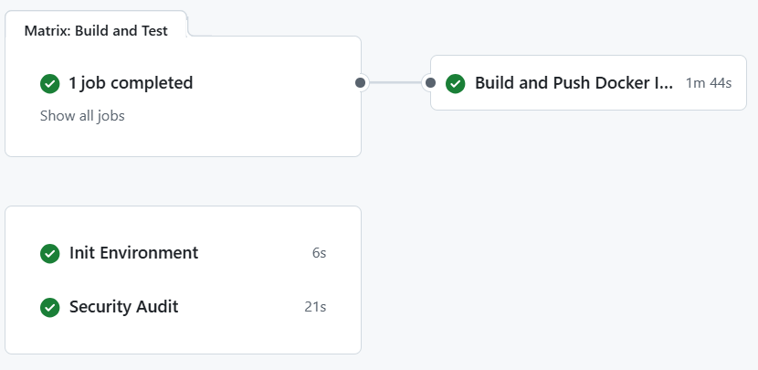
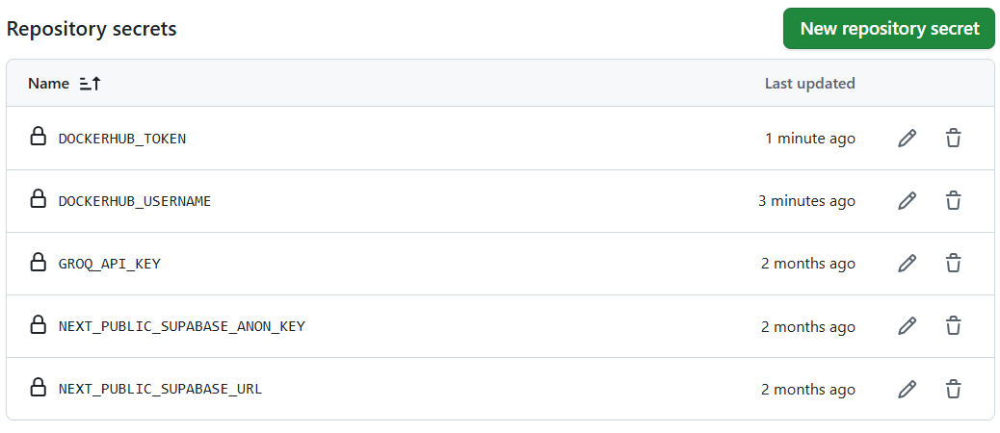
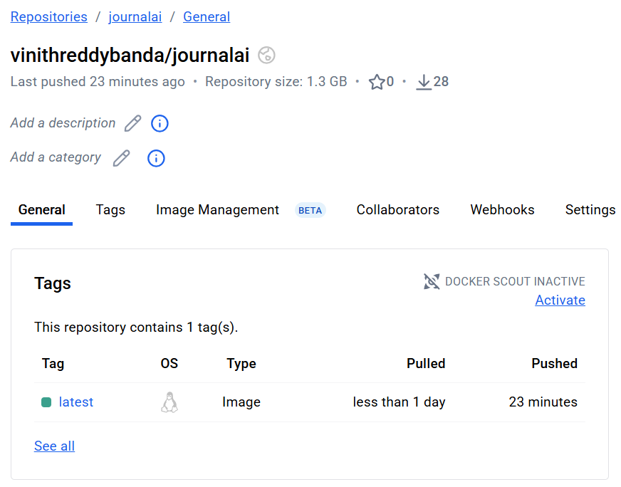
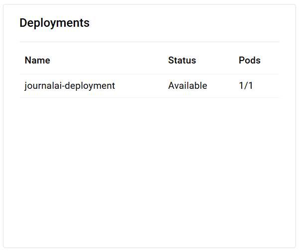
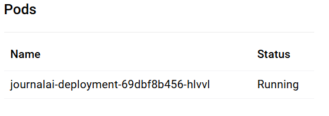
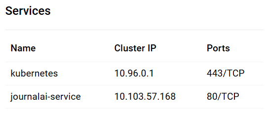
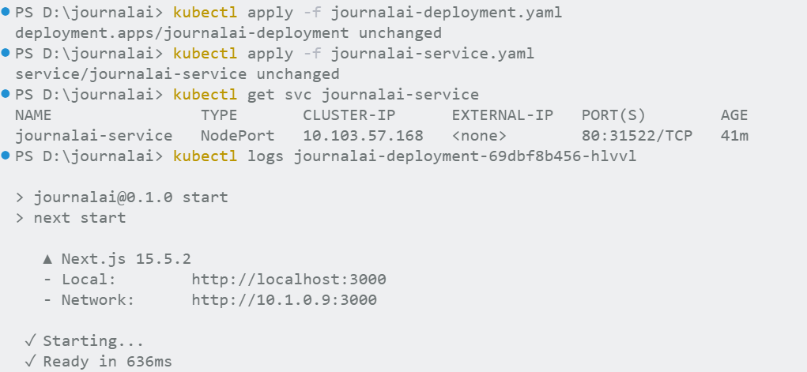
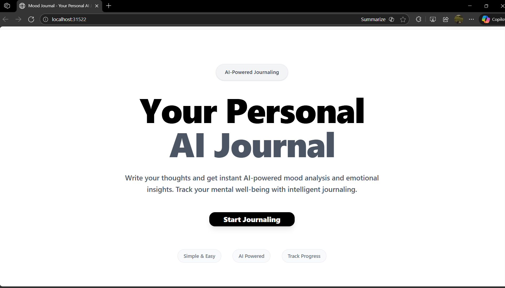
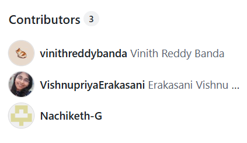

# JournalAI: End-to-End DevOps & Cloud Deployment Guide [](https://github.com/vinithreddybanda/journalai/actions/workflows/ci-simple.yml)

<div style="font-family: 'Times New Roman', Times, serif;">

## Abstract

JournalAI is a modern Next.js application with Supabase integration, designed to demonstrate full-stack DevOps automation, containerization, Kubernetes orchestration, and cloud deployment using Azure Container Instances. This documentation provides a detailed, IEEE-style guide for developers and DevOps engineers, covering every step from local development to production deployment.

---

## Table of Contents
1. [Project Overview](#project-overview)
2. [Local Development](#local-development)
3. [Git & GitHub Workflows](#git--github-workflows)
4. [CI/CD Automation](#cicd-automation)
5. [Docker & Docker Hub](#docker--docker-hub)
6. [Kubernetes Deployment](#kubernetes-deployment)
7. [Azure Container Instances (ACI)](#azure-container-instances-aci)
8. [Secrets Management](#secrets-management)
9. [Results & Monitoring](#results--monitoring)
10. [References](#references)

---

## 1. Project Overview

JournalAI is a Next.js 15.5.2 web application using Supabase for backend services. The project is structured for rapid prototyping and robust cloud deployment.

**Key Features:**
- Next.js frontend
- Supabase integration
- Automated CI/CD with GitHub Actions
- Containerization with Docker
- Kubernetes manifests for scalable deployment
- Azure ACI cloud hosting

---

## 2. Local Development

Clone the repository and install dependencies:
```bash
git clone https://github.com/vinithreddybanda/journalai.git
cd journalai
npm install
```

Run locally:
```bash
npm run dev
```

---

## 3. Git & GitHub Workflows

All code changes are managed via Git and GitHub. The repository uses feature branches and pull requests for code review.


*Figure 1: GitHub Actions workflow overview.*

**Common Commands:**
```bash
git add .
git commit -m "Your message"
git push origin main
```

---

## 4. CI/CD Automation

CI/CD is powered by GitHub Actions. The workflow (`.github/workflows/ci-simple.yml`) automates linting, testing, Docker image build, and push to Docker Hub.

**Workflow Highlights:**
- Lint, type-check, and test on every push
- Build Docker image with Supabase secrets
- Push image to Docker Hub


*Figure 2: Example of repository secrets for CI/CD.*

**Sample Workflow Snippet:**
```yaml
jobs:
	build-and-push:
		steps:
			- name: Build Docker image
				run: |
					docker build \
						--build-arg NEXT_PUBLIC_SUPABASE_URL=${{ secrets.NEXT_PUBLIC_SUPABASE_URL }} \
						--build-arg NEXT_PUBLIC_SUPABASE_ANON_KEY=${{ secrets.NEXT_PUBLIC_SUPABASE_ANON_KEY }} \
						-t ${{ secrets.DOCKERHUB_USERNAME }}/journalai:latest .
			- name: Push Docker image
				run: docker push ${{ secrets.DOCKERHUB_USERNAME }}/journalai:latest
```

---

## 5. Docker & Docker Hub

The app is containerized using a multi-stage Dockerfile. Images are published to Docker Hub for portability.


*Figure 3: Docker Hub repository for container images.*

**Build & Push Locally:**
```bash
docker build -t vinithreddybanda/journalai:latest .
docker push vinithreddybanda/journalai:latest
```

---

## 6. Kubernetes Deployment

Kubernetes manifests (`journalai-deployment.yaml`, `journalai-service.yaml`) enable scalable deployment on local clusters (Docker Desktop) or cloud.

**Deployment Steps:**
```bash
kubectl apply -f journalai-deployment.yaml
kubectl apply -f journalai-service.yaml
kubectl get pods
kubectl get svc
```


*Figure 4: Kubernetes deployment manifest.*


*Figure 5: Kubernetes pods status.*


*Figure 6: Kubernetes nodes overview.*


*Figure 7: Kubernetes services configuration.*


*Figure 8: Kubernetes cluster running state.*

**Accessing the App:**
Find the NodePort and open in browser: `http://localhost:<NodePort>`

---

## 7. Azure Container Instances (ACI)

For cloud deployment, the Docker image is run in Azure Container Instances.

**Deployment Command:**
```powershell
az container create --resource-group my-rg --name journalai-container --image vinithreddybanda/journalai:latest --ports 3000 --dns-name-label journalai-aci-demo --location centralindia --os-type Linux --cpu 1 --memory 1.5 --environment-variables NEXT_PUBLIC_SUPABASE_URL=<your_url> NEXT_PUBLIC_SUPABASE_ANON_KEY=<your_key> GROQ_API_KEY=<your_groq_key>
```

**Results:**

*Figure 9: Azure Container Instance deployment result.*

## Additional Images

### Contributor Overview

*Figure 10: Project contributors on GitHub.*


**Access:**
Azure provides a public FQDN, e.g., `http://journalai-aci-demo.centralindia.azurecontainer.io:3000`

---

## 8. Secrets Management

Secrets (Supabase keys, DockerHub credentials, Azure credentials) are managed via GitHub repository secrets and passed securely to workflows and containers.

**Example:**
```yaml
env:
	NEXT_PUBLIC_SUPABASE_URL: ${{ secrets.NEXT_PUBLIC_SUPABASE_URL }}
	NEXT_PUBLIC_SUPABASE_ANON_KEY: ${{ secrets.NEXT_PUBLIC_SUPABASE_ANON_KEY }}
	GROQ_API_KEY: ${{ secrets.GROQ_API_KEY }}
```

---

## 9. Results & Monitoring

Monitor deployments via Azure Portal, `kubectl logs`, and GitHub Actions status.

**Sample Log Command:**
```bash
kubectl logs <pod-name>
```

**ACI Monitoring:**
Check status and logs in Azure Portal or with:
```powershell
az container show --resource-group my-rg --name journalai-container --output table
```

---

## 10. References

- [Next.js Documentation](https://nextjs.org/docs)
- [Supabase Documentation](https://supabase.com/docs)
- [GitHub Actions](https://docs.github.com/en/actions)
- [Docker Documentation](https://docs.docker.com)
- [Kubernetes Documentation](https://kubernetes.io/docs)
- [Azure Container Instances](https://learn.microsoft.com/en-us/azure/container-instances/)

</div>
